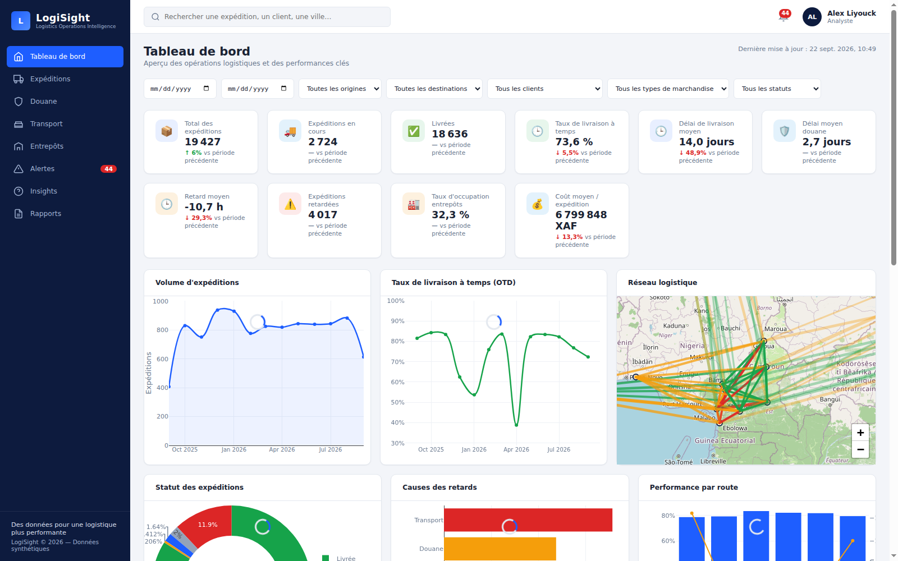
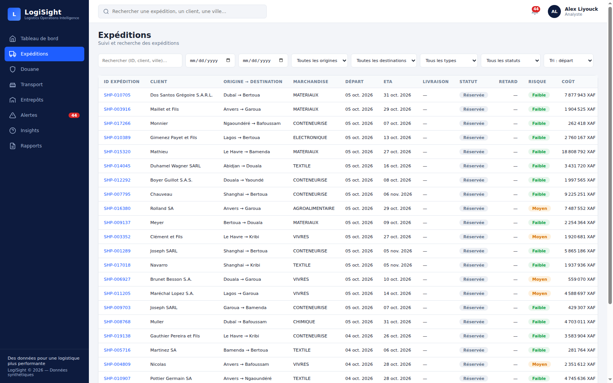
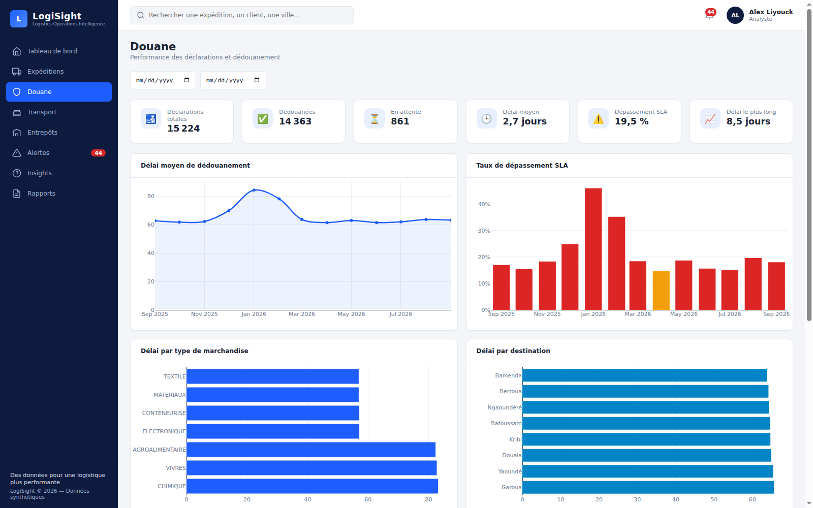
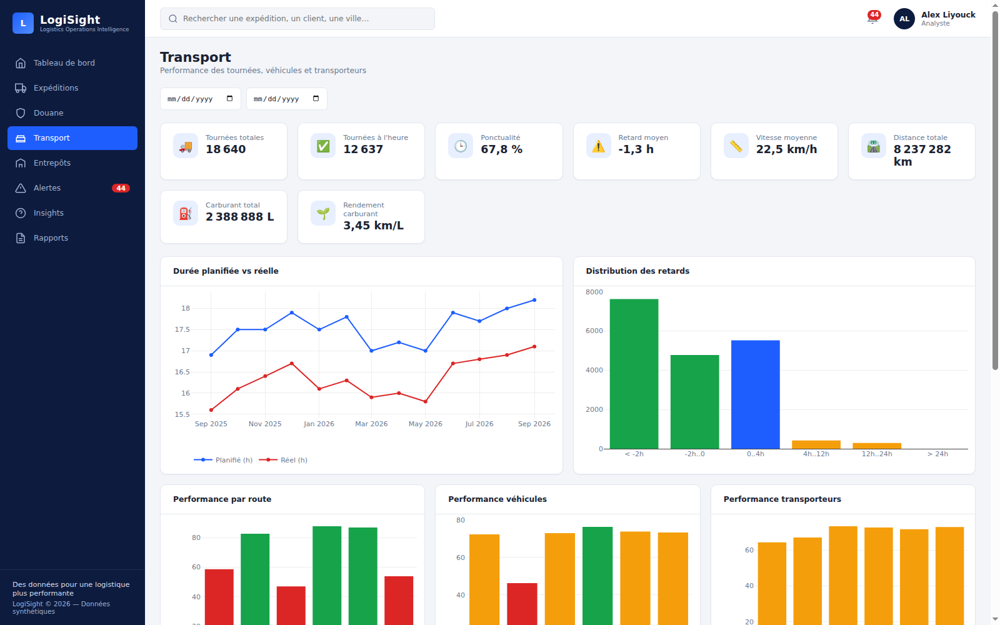
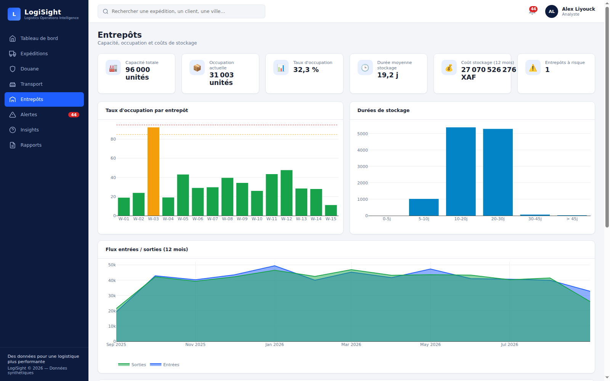
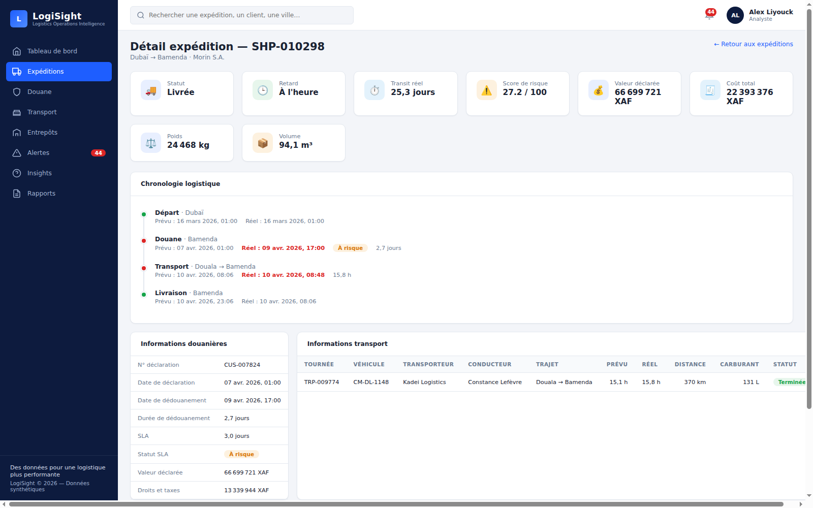
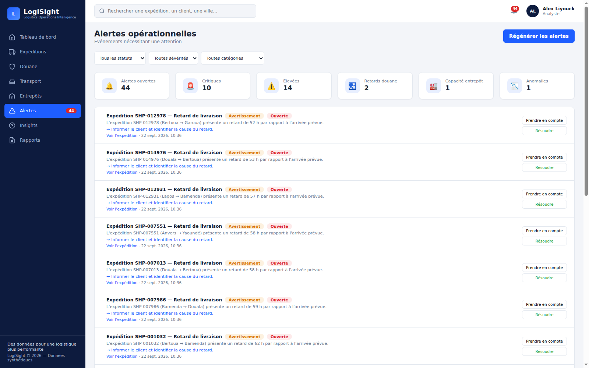

# LogiSight — Logistics Operations Intelligence Platform


Plateforme d'intelligence opérationnelle logistique (projet portfolio),
simulant des opérations dans un contexte inspiré du Cameroun / CEMAC.

> ⚠️ **Données 100 % synthétiques** — ce projet est indépendant et fictif.
> Les données ne représentent aucune entreprise réelle ni statistiques officielles.

## 🚀 Démarrage rapide

```bash
git clone <repo> && cd logisight
make setup            # venv + dépendances + migrations + données + alertes
python run.py         # → http://localhost:5000
```

---

## 1. Aperçu du produit

LogiSight transforme des données opérationnelles synthétiques en décisions :
**DONNÉES → KPI → VISUALISATION → INSIGHT → ACTION**.

L'application aide un responsable logistique à répondre à des questions telles que :

- Combien d'expéditions sont en mouvement ? Livrées à temps ?
- Où sont les plus grands retards ? Quels processus douaniers bloquent ?
- Quels corridors, transporteurs ou véhicules sous-performent ?
- Quels entrepôts approchent de leur capacité ?
- Quelle est l'évolution de la performance dans le temps ?

### Démarche analytique (démo)

L'application raconte une histoire : *la performance opérationnelle s'est
dégradée sur une période donnée.*

```
Tableau de bord (baisse OTD détectée)
  → Performance par corridor (Douala → Bertoua identifié)
    → Analyse douane (contribution du dédouanement)
      → Expéditions impactées
        → Alertes opérationnelles
          → Insights de gestion & recommandation
            → Export de rapport
```

## 2. Captures d'écran

### Tableau de bord


### Expéditions


### Douane


### Transport


### Entrepôts


### Détail d'une expédition (chronologie)


### Alertes opérationnelles


## 3. Fonctionnalités

- **Tableau de bord exécutif** — 10 KPI avec comparaison de période, 7
  visualisations (volume, OTD, statuts, causes de retard, performance routes,
  dédouanement, entrepôts), carte logistique Leaflet interactive, alertes et
  insights en direct.
- **Expéditions** — recherche plein texte, filtres (dates, origine, destination,
  client, marchandise, statut), tri, pagination, fiche détaillée avec
  chronologie visuelle (Départ → Douane → Transport → Livraison).
- **Douane** — KPI SLA (délai moyen, dépassements), tendances, analyses par
  marchandise/destination, registre des dépassements.
- **Transport** — ponctualité des tournées, planifié vs réel, performance
  par corridor/véhicule/transporteur, distribution des retards, rendement carburant.
- **Entrepôts** — occupation avec seuils de risque, durées de stockage,
  flux entrées/sorties, coûts.
- **Alertes** — génération par règles (retards, SLA, capacité, anomalies
  statistiques z-score), workflow Ouverte → Prise en compte → Résolue.
- **Insights** — moteur déterministe (métrique, valeur, seuil, action recommandée).
- **Rapports** — 5 types de rapports, export **CSV**, **Excel** et **PDF**.
- **Qualité de données** — endpoint de contrôle (dates incohérentes, valeurs
  négatives, doublons, occupation excessive).

## 4. Architecture

Voir [`docs/architecture.md`](docs/architecture.md).

```
logisight/
├── app/
│   ├── __init__.py            # factory + erreurs + health
│   ├── config.py              # configuration par variables d'env
│   ├── models/                # SQLAlchemy (9 tables, index)
│   ├── routes/                # pages (Jinja) + API /api/v1
│   ├── analytics/             # KPI, risque, alertes, insights, stats
│   ├── services/              # rapports CSV/Excel/PDF
│   ├── templates/pages/       # 9 pages
│   └── static/                # css (tokens+base) · js (app + pages)
├── migrations/                # Alembic (Flask-Migrate)
├── scripts/                   # generate_data · generate_alerts · référence
├── tests/                     # unit · integration · api (pytest)
├── docs/                      # architecture · api · kpis · development
├── data/                      # logisight.db (non committé)
├── deployment.yml             # configuration de déploiement manuel
├── Makefile · run.py · requirements.txt · .env.example
```

## 5. Stack technique

| Couche | Choix |
|---|---|
| Backend | Python 3.12+, Flask, Flask-SQLAlchemy, Flask-Migrate, Flask-CORS |
| Base de données | SQLite 3 |
| Analyse | Pandas/NumPy (générateur), agrégations SQL |
| Frontend | HTML5/CSS3, Vanilla JS, Plotly.js, Leaflet.js — sans framework |
| Tests | pytest, pytest-flask |
| Divers | Faker, openpyxl, ReportLab, Gunicorn, python-dotenv |

## 6. Modèle de données

Voir [`docs/architecture.md`](docs/architecture.md#modèle-de-données).
9 tables : `customers`, `shipments`, `customs_declarations`, `vehicles`,
`trips`, `warehouses`, `warehouse_transactions`, `routes`, `alerts`.

## 7. Définitions des KPI

Toutes les formules sont documentées dans [`docs/kpis.md`](docs/kpis.md)
(OTD, délais, SLA douane, occupation, rendement carburant, score de risque
0–100, règles d'insights).

## 8. Installation détaillée

Le `make setup` du démarrage rapide enchaîne les étapes ci-dessous —
les commandes granulaires :

```bash
python3 -m venv .venv && source .venv/bin/activate
pip install -r requirements.txt
cp .env.example .env                       # renseigner SECRET_KEY
flask --app run.py db upgrade              # migrations
python scripts/generate_data.py            # données synthétiques (SEED=42)
python scripts/generate_alerts.py          # alertes opérationnelles
```

## 9. Déploiement manuel

```bash
cp .env.example .env                       # renseigner SECRET_KEY
source .venv/bin/activate
flask --app run.py db upgrade              # migrations
python scripts/generate_data.py            # données (SEED=42 par défaut)
python scripts/generate_alerts.py          # alertes
python run.py                              # http://localhost:5000
# production :
.venv/bin/gunicorn -w 4 -b 0.0.0.0:8000 run:app
```

Configuration détaillée : [`deployment.yml`](deployment.yml) et
[`docs/development.md`](docs/development.md). **Aucun Docker** — déploiement
100 % manuel sur un environnement Python standard.

## 10. Génération de données

```bash
SEED=42 N_SHIPMENTS=20000 N_MONTHS=24 python scripts/generate_data.py
```

- 100 clients · 20 véhicules · 15 entrepôts · 54 corridors · **20 000 expéditions**
  sur 24 mois · ~15 200 déclarations douanières · ~19 000 tournées ·
  mouvements d'entrepôt.
- Corrélations réalistes : distance → durée, cargaisons inspectées → dédouanement
  plus long, forte valeur → contrôle accru, week-ends, incidents aléatoires,
  véhicules moins efficients, clients à retards récurrents.
- **Scénarios métier** injectés : ralentissement douanier, corridor
  Douala → Bertoua dégradé, entrepôt W-03 à 92 %, surconsommation de 4 véhicules,
  clients à retard récurrents, backlog opérationnel.
- Reproductible : même `SEED` ⇒ mêmes données.

## 11. API

Catalogue complet : [`docs/api.md`](docs/api.md). Préfixe `/api/v1`,
réponses homogènes `{success, data, meta}`, filtres et pagination.

```bash
curl http://localhost:5000/health
curl "http://localhost:5000/api/v1/dashboard/summary"
curl "http://localhost:5000/api/v1/shipments?status=DELAYED&per_page=10"
curl -X PATCH http://localhost:5000/api/v1/alerts/1 \
     -H "Content-Type: application/json" -d '{"status":"ACKNOWLEDGED"}'
```

## 12. Tests

```bash
make test
```

47 tests : KPI, score de risque (bandes LOW→CRITICAL), statistiques (z-score,
IQR, moyenne mobile), intégration modèle/qualité/alertes, et tous les
endpoints API (pagination, filtres, transitions d'alertes, exports).

## 13. Limites connues

- L'authentification est volontairement absente (MVP portfolio) ; un mécanisme
  de démo simple serait la première brique à ajouter.
- SQLite single-writer : dimensionné pour la démonstration, pas pour la charge.
- Les sévérités d'alertes et seuils d'insights sont des constantes documentées,
  pas configurables à chaud.
- Le PDF des rapports est tabulaire (pas de graphiques embarqués).
- Les durées maritimes des corridors internationaux sont des approximations
  synthétiques.

## 14. Avertissement données synthétiques

L'intégralité des données est **générée algorithmiquement** (graine fixe) dans
un cadre fictif inspiré du Cameroun/CEMAC. Les valeurs (coûts, délais, volumes)
n'ont **aucune** valeur statistique réelle. Aucune affiliation avec une
entreprise ou administration réelle.

## 15. Améliorations futures

- Authentification + rôles (direction, analyste, opérateur)
- Rafraîchissement temps réel (SSE/WebSocket) des alertes
- Prévisionnel (séries temporelles) sur volume et OTD
- Détection d'anomalies multivariée (isolation forest) en complément des règles
- Cache applicatif + tables pré-calculées si le volume croît
- Internationalisation EN/FR complète côté interface
